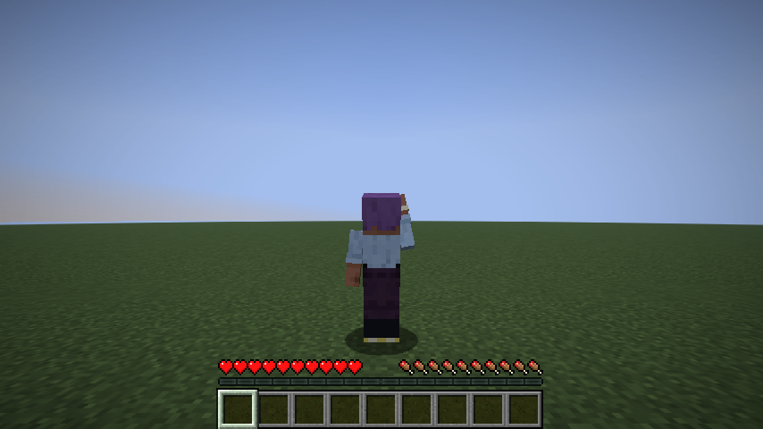
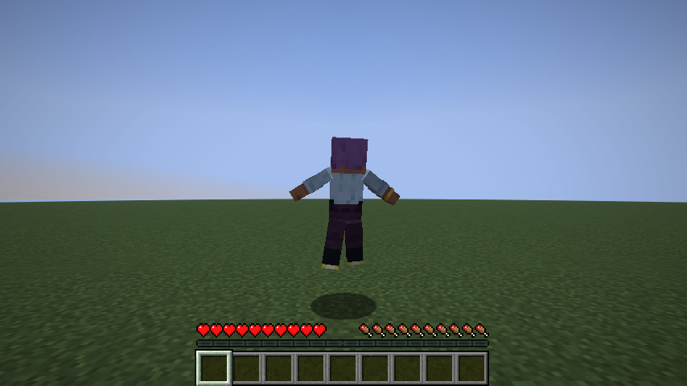

# Emote Studio

Custom player emotes for **Minecraft 26.2** (Fabric), with **220 built-in emotes** and a complete
in-game animation editor. Works in singleplayer, on a LAN world, on a Fabric server — and on a
vanilla server that does not have the mod at all.




## What it does

- **220 detailed built-in emotes** — 34 775 keyframes in total, so every emote animates several body
  parts at once rather than striking a pose and holding it. Includes `float`, `heaven`, `moonwalk`,
  `macarena`, `floss`, `robot`, `breakdance`, `worm`, `backflip`, `meditate`, `sleep` and many more,
  across seven categories.
- **A full editor inside the game** — timeline, keyframes, per-part channels, easing curves, live
  preview on your own character.
- **Your emotes are plain files** — everything you make is saved to `.minecraft/emotes/` as readable
  JSON you can edit, back up, or send to a friend.
- **Emotes are visible to other players** — in singleplayer and LAN, on a modded server, *and on a
  plain vanilla server that has never heard of this mod*.

## Servers without the mod

A vanilla server throws custom packets away — `handleCustomPayload` on the server is literally an
empty method — so no mod can push arbitrary data from one client to another through it. Chat is the
one channel a vanilla server does relay between players, so that is what the mod falls back to.

When it detects that the server does not speak its protocol, playing an emote posts one short line:

```
<Zihan> [emote] moonwalk
```

- Players **with the mod** see the full animation, and the line is hidden from their chat.
- You are told once, the first time it happens, and `/emote chatsync off` turns it off for good.

The chat line only helps players who have the mod, so there is a second fallback for everyone else.

## Players without the mod

A vanilla client cannot be told to bend another player's arm: the protocol carries no limb angles,
and `PlayerModel` recomputes them locally from movement. So no packet will ever make an unmodded
client draw a pose.

But a vanilla server already relays four things about you that every vanilla client knows how to
draw: **body rotation, head rotation, arm swings, and crouching or hopping**. When nothing else can
reach those players, the mod drives all four from the emote's own curves. Your character really
turns, looks, swings and bobs in the emote's rhythm, and everyone sees it — no mod anywhere.

A spin emote spins you. A wave swings your arm on the beat. A bow dips your head. A sit crouches
you. It is a silhouette of the emote rather than the emote itself, but every one of the 220 produces
something visible to everyone.

**This part is real movement.** Everything else in the mod only changes how you are drawn; this
actually rotates your player and presses jump and sneak. It stays strictly inside what you could do
by hand — no teleporting, no flying, no speed — and a real unmodded 26.2 server accepted it without
a single movement warning. It only runs when the server lacks the mod, which is exactly when it is
the only way anyone could see anything, and `/emote physical off` disables it.

### What each kind of player sees

| Situation | Result |
| --- | --- |
| Singleplayer | You see your emotes |
| LAN or server **with** the mod | Everyone with the mod sees the full animation, custom emotes included |
| Server **without** the mod, viewer **with** the mod | Full animation, carried over chat |
| Server **without** the mod, viewer **without** the mod | Your body turns, swings, crouches and hops in the emote's rhythm |

The remaining limit is the limb poses themselves: an unmodded client will never draw the exact arm
and leg angles, because it has no code that can. Two smaller ones on the chat fallback: it names an
emote rather than carrying it, so a custom emote only animates for players who also have that file,
and it is rate limited to one message every 1.5 s so the spam filter never has a reason to act.

## Why it will not get you banned

The animation itself is **purely visual**. The mod never moves your player, never changes your
position, velocity, rotation or pose, and never sends movement packets. It only changes how your
character is *drawn*:

- limb animation is applied inside the player model, at render time;
- whole-body motion (`float`, `heaven`, `moonwalk`) is applied to the render transform only.

You can see this in the screenshot above: while floating, the character is drawn in the air but the
shadow — and the real position the server knows about — stays on the ground. Nothing an anti-cheat
looks at ever changes.

The only packets the mod sends are its own cosmetic ones (`emotestudio:play_emote`,
`emotestudio:stop_emote`) when the server has the mod, and an ordinary chat message when it does not.
Neither is a movement packet, and neither claims anything about where your player is.

The one exception is the physical performance described above, which runs only on servers without
the mod. That one does move you — but only through ordinary rotation, jump and sneak input, the same
things the server sees from any player pressing keys. Turn it off with `/emote physical off` if you
would rather nothing about your player changes at all.

> On a public server the rules are set by its owners, not by the client. If a server forbids client
> mods, this one is no exception, regardless of how it works.

## Installing

1. Install [Fabric Loader](https://fabricmc.net/use/) `0.19.3+` for Minecraft `26.2`.
2. Put [Fabric API](https://modrinth.com/mod/fabric-api) `0.157.0+26.2` in your `mods` folder.
3. Put `emotestudio-1.0.0.jar` in your `mods` folder.
4. Java `25+` is required (Minecraft 26.2 requires it too).

For LAN: only the host and the players who want to *see* emotes need the mod. For a dedicated
server, put the same jar in the server's `mods` folder.

## Using it

| Key | Action |
| --- | --- |
| `B` | Emote wheel — aim, click, done |
| `J` | Emote list, with search and preview |
| `K` | Emote editor |
| `X` | Stop the current emote |
| `1`–`8` (unbound by default) | Quick-slot emotes |

Commands (client-side, so they work on any server):

```
/emote                 open the emote list
/emote play <id>       play an emote
/emote stop            stop
/emote list            how many emotes are loaded, by category
/emote reload          re-read the emotes folder
/emote editor [id]     open the editor, optionally on an existing emote
/emote folder          print the path to your emotes folder
/emote chatsync on|off toggle the chat fallback used on servers without the mod
/emote physical on|off toggle the physical performance seen by players without the mod
```

In the emote list, press `1`–`8` to bind the highlighted emote to a quick slot, and `★` to favourite
it — favourites fill the wheel first.

## The editor

Open it with `K` or `/emote editor`.

- **Left** — the seven animatable parts. `▶` marks the one you are editing, `•` marks parts that
  already have keyframes.
- **Middle** — your character, animating live. Drag to turn it.
- **Right** — the nine channels of the selected keyframe: rotation (degrees), offset (model pixels),
  scale. Below them: length, blend in, blend out, speed.
- **Bottom** — the timeline. Click a mark to select that keyframe, click anywhere else to scrub.

| Shortcut | Action |
| --- | --- |
| `Space` | Play / pause |
| `K` | Add a keyframe at the playhead |
| `Del` | Delete the selected keyframe |
| `←` / `→` | Step one tick |
| `Tab` | Next body part |
| `Ctrl`+`S` | Save |

Moving a slider when there is no keyframe under the playhead creates one first, so an edit is never
silently lost. **Mirror R→L** copies the right limbs onto the left with the sideways axes flipped.

Editing a built-in emote saves a copy under the same id in your emotes folder, and your copy wins —
that is how you customise `moonwalk` without touching the jar.

## The emote file format

Files live in `.minecraft/emotes/` and are named `<id>.emote.json`:

```json
{
  "id": "my_wave",
  "name": "My Wave",
  "category": "greeting",
  "length": 30,
  "loop": true,
  "blendIn": 3,
  "blendOut": 3,
  "tracks": {
    "rightArm": [
      { "t": 0,  "rot": [-150, 0, 18], "ease": "sine_in_out" },
      { "t": 15, "rot": [-150, 0, 46], "ease": "sine_in_out" },
      { "t": 30, "rot": [-150, 0, 18] }
    ]
  }
}
```

- `length`, `t`, `blendIn`, `blendOut` are in **ticks** (20 ticks = 1 second).
- `rot` is in **degrees**, `pos` in **model pixels** (1/16 block), `scale` is a multiplier.
- Parts: `root`, `head`, `body`, `rightArm`, `leftArm`, `rightLeg`, `leftLeg`.
- `root` is not a body part — it moves and turns the whole character, which is what gives `float`
  and `moonwalk` their travel.
- **+Y is up** everywhere, and **-Z is the way the player faces**.
- `ease` describes the curve *towards the next keyframe*: `linear`, `step`, `smooth`, `sine_in_out`,
  `cubic_out`, `back_in`, `elastic_out`, `bounce_out`, and the rest of the `Easing` enum.

A looping emote should end where it starts, or it will jolt once per cycle. The generator that
builds the shipped emotes enforces this; if you write files by hand, keep it in mind.

## Building from source

```bash
cd emotestudio
JAVA_HOME=/path/to/jdk25 ./gradlew build
```

The jar lands in `build/libs/`. Minecraft 26.2 ships unobfuscated, so there is no mappings layer and
no remapping step — the build uses named Minecraft classes directly.

### Regenerating the built-in emotes

The 220 built-ins are generated from curve definitions rather than hand-written:

```bash
cd tools
python3 generate_emotes.py
```

- `emote_dsl.py` — curve primitives and the keyframe sampler.
- `archetypes.py` — the choreographies (`wave`, `moonwalk`, `float_idle`, …) with their parameters.
- `generate_emotes.py` — the catalogue of 220 named emotes and the writer.

The generator refuses to emit a looping emote that does not close cleanly, which is what keeps 188
looping emotes seam-free.

### Tests

An end-to-end client test boots a real client, loads a world, plays emotes and reads the resulting
pose straight off the rendered player model:

```bash
./gradlew runClientGameTest      # needs a display; use xvfb-run on a headless machine
```

It checks that all 220 emotes load, that `point_up` really holds the arm at -168°, that `float`
lifts the avatar, and that stopping hands the model back to vanilla.

A second test covers the unmodded-server path. Start any plain vanilla server, then:

```bash
./gradlew runClientGameTest -PemoteTestServer=127.0.0.1:25565
```

It joins that server, asserts the mod correctly detects that the protocol is unavailable, that the
emote still animates, that the chat announcement goes out — which the server's own log confirms —
and that a spin emote really turns the player's body while staying inside ordinary movement.
Without the property, the test skips itself.

## Compatibility

- Minecraft `26.2`
- Fabric Loader `0.19.3+`
- Fabric API `0.157.0+26.2`
- Java `25+`

The mod is safe to install on only some of the players in a world: those without it simply will not
see the emotes.

## Licence

MIT.
